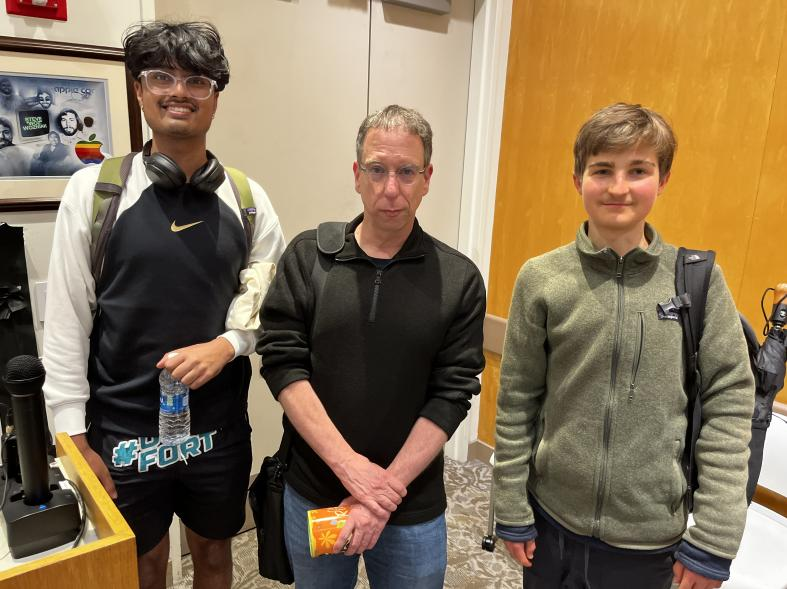

This May, I had the pleasure of attending the Zero-Knowledge Proof Hackathon Ceremony held at UC Berkeley. The hackathon, which was organized as part of the [zero-knowledge MOOC course](https://rdi.berkeley.edu/course/zkp/s23), attracted an astonishing 600 participants from all over the world, while the MOOC itself boasted an impressive 4,000 registrants. As a student who had completed the official course offered by UC Berkeley with a cohort of about 50 other students, I was excited to participate in this event.

The hackathon aimed to enhance UC Berkeley's ZK-Harness benchmarking software, as well as to develop new zero-knowledge circuits and applications. Zero-knowledge proofs and circuits enable individuals to demonstrate statements to others while disclosing only the bare minimum of information required to validate the proof. This technology holds enormous promise for privacy-preserving tools and software.

One of the highlights of the event was a presentation by [Shafi Goldwasser](https://en.wikipedia.org/wiki/Shafi_Goldwasser), a Turing award-winning computer scientist and the co-inventor of ZKPs. Goldwasser spoke about the potential for zero-knowledge proofs to be used in AI applications to safeguard privacy. She posited that ZKPs could help AI companies make claims about their software without revealing their source code, a development that could have far-reaching implications for the technology sector.

The use of ZKPs in AI would offer a solution to the ongoing conflict between artists and AI companies. Artists have accused AI companies of using their work without their consent to train their models. A straightforward resolution to this issue would be to require companies to divulge their source code and data, but doing so would compromise their proprietary information and pose privacy risks. ZKPs could provide an alternative solution by allowing companies to prove their claims without revealing anything but the claim itself. One example would be proving whether a specific dataset was used or not.

However, a key challenge in integrating AI with zero-knowledge proofs is that AI models are notoriously difficult to interpret. As Goldwasser noted, AI models are often referred to as "black boxes" because it is difficult to understand their behavior or predict their output. Zero-knowledge proofs, by contrast, are grounded in mathematics and require precise operating conditions. It is unclear at this stage whether ZKPs can be used with less predictable AI models.

Overall, the ceremony was a fascinating opportunity to engage with leading experts in this field and to gain insights into the cutting-edge developments in zero-knowledge proofs and their applications.

